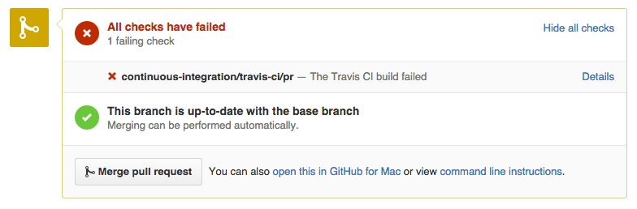
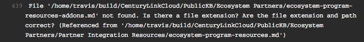
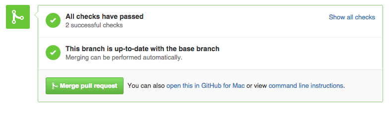

[](https://travis-ci.org/CenturyLinkCloud/APIDocs)

#CenturyLink Cloud API Documentation
========

Welcome to the [CenturyLink Cloud](http://www.ctl.io) API Documentation repository.  Please follow the guidelines below to contribute or make changes.

If you are new to Git and Github, we highly recommend spending 5 minutes reading this great article on [Understanding the Github Flow](https://guides.github.com/introduction/flow/). This repo follows the Github Flow.

## How To Make Contributions

1. [Fork](https://guides.github.com/activities/forking/) the https://github.com/CenturyLinkCloud/APIDocs repository. This will produce a personal copy of this repo.

1. Clone the repo to your desktop.

1. **Anything in the `master` branch is always deployable.** Create a [new branch](https://github.com/blog/1377-create-and-delete-branches) from `master`. Your branch name should be descriptive (e.g., `server-power-operations`) so that others have an idea of what the branch is for.

1. The `master` branch represents version 2 of the api, while the `v-1` branch is version 1.

1. Once your branch has been created, make your changes (add, edit, delete) your knowledge base article in your favorite Markdown editor (we like [Atom](https://atom.io/)).

1. Commit your change(s) locally to your fork/branch.

1. Push or sync your commit(s) to the remote repository on Github.

1. Create a [pull request](https://help.github.com/articles/creating-a-pull-request) to merge your changes into the `master` branch.
  * [Create a pull request using Github for Windows](https://github.com/blog/1969-create-pull-requests-in-github-for-windows)
  * [Create a pull request using Github for Mac](https://github.com/blog/1946-create-pull-requests-with-github-for-mac)

1. This repository contains a [commit analyzer](https://github.com/CenturyLinkCloud/KB-Commit-Analyzer) that runs against each file in the repository validating that the following are true:

  * File's JSON [front-matter](#front-matter) parses correctly and contains the required fields (title, date, autor)
  * File's markdown successfully parses
  * All [links](#links-kb-article-to-kb-article) and [images](#images) are valid (doesn't return 404)

  Issuing a pull-request will automatically trigger the commit analyzer to validate any changes to the repository as part of continuous integration with [travis-ci](http://travis-ci.org). If you try to commit changes in which there are syntax errors or broken links, the build log from travis-ci will display which files contain errors, and you will receive an email notification that the build failed.

  A pull-request containing errors will look like this:
  

  Any error(s) will be displayed in the Travis-CI build log. The build log is accessible at [https://travis-ci.org/CenturyLinkCloud/PublicKB](https://travis-ci.org/CenturyLinkCloud/PublicKB) or by clicking on the "Details" link on the pull request page on Github. Here's an example of a broken link:
  

  Pushing/syncing additional commits to your fork/branch will trigger the analyzer to re-check your changes.

  A pull-request without errors will also look like this:
  

  **Content authors are responsible for making their pull requests pass the commit analyzer. Once they pass, pull requests will be merged.**

1. CenturyLink Cloud Team reviews your pull request. If accepted, it will be added to the [API Documentation on CenturyLinkCloud.com](https://www.ctl.io/api-docs/v2).


#### Run the Commit Analyzer locally

If your `APIDocs/lib` directory is empty, ensure that GitHub ssh is setup correctly, cd to the project root, and run:

```shell
git submodule update --init --recursive
```

To run this check locally, `cd` into the root of this project and run:

```shell
node lib/index.js
```

_Note that the first time you wish to run the commit analyzer, you'll have to run `npm install` from the `lib` directory. This assumes you have [Node.js](http://nodejs.org) installed._

### Links (API doc to API doc)


Links to other articles should follow this format:

```
[Link Text](../category/api-doc-name.md)
```

so like this (folder names are case-sensitive):

```
[API v2.0 Overview](../Getting Started/api-v2-overview.md)
[Login](../Authentication/login.md )
```

### Commit Analyzer

This repository contains a [commit analyzer](https://github.com/CenturyLinkCloud/KB-Commit-Analyzer) that runs against each file in the repository validating that the following are true:

* File's JSON front-matter parses correctly and contains the required fields (title, date, autor)
* File's markdown successfully parses
* All relative files (images and other markdown files) are valid links

To run this check locally, `cd` into the root of this project and run:

```shell
node lib/index.js
```

_Note that the first time you wish to run the commit analyzer, you'll have to run `npm install` from the `lib` directory. This assumes you have [Node.js](http://nodejs.org) installed._

The output will tell you if any file fails parsing. This script is also run as part of continuous integration with [travis-ci](http://travis-ci.org).

TODO: REVERT THIS

#### Ignoring Files

If a file contains a link that the commit analyzer catches as being invalid (such as in a code sample), and you'd like the analyzer to ignore that file, you can add the filename to `commit_analyzer_ignore.txt`. (It isn't necessary to include the entire file path; just the filename will suffice.) Each new file should be separated by a new line.
