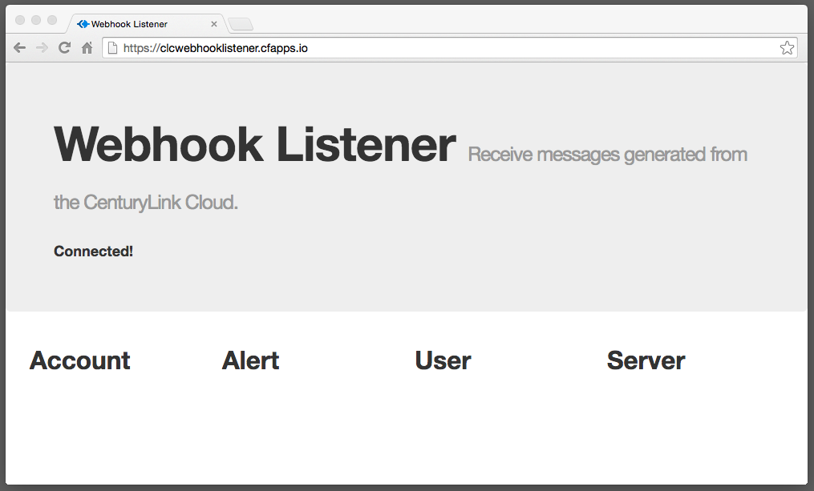
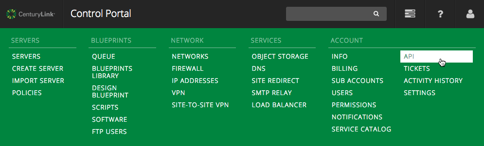
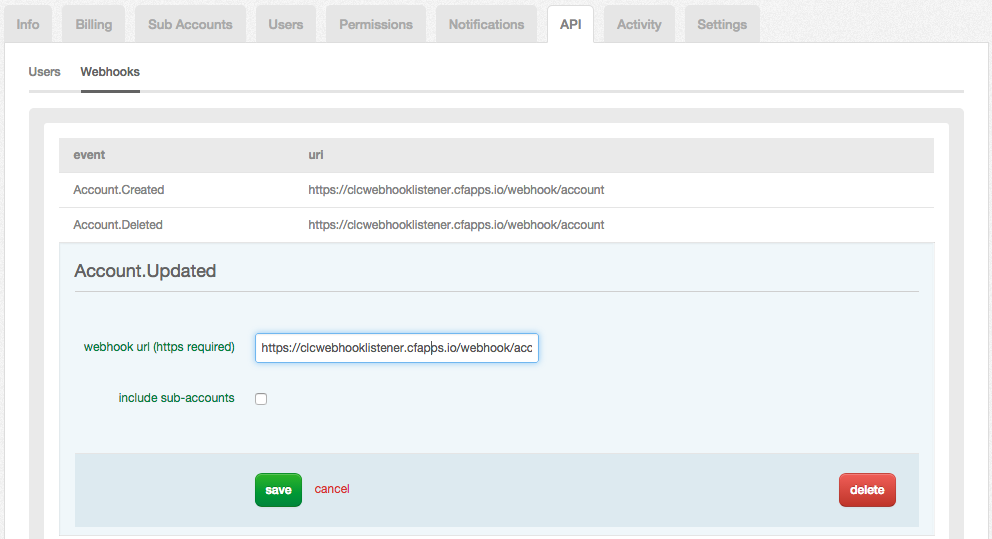
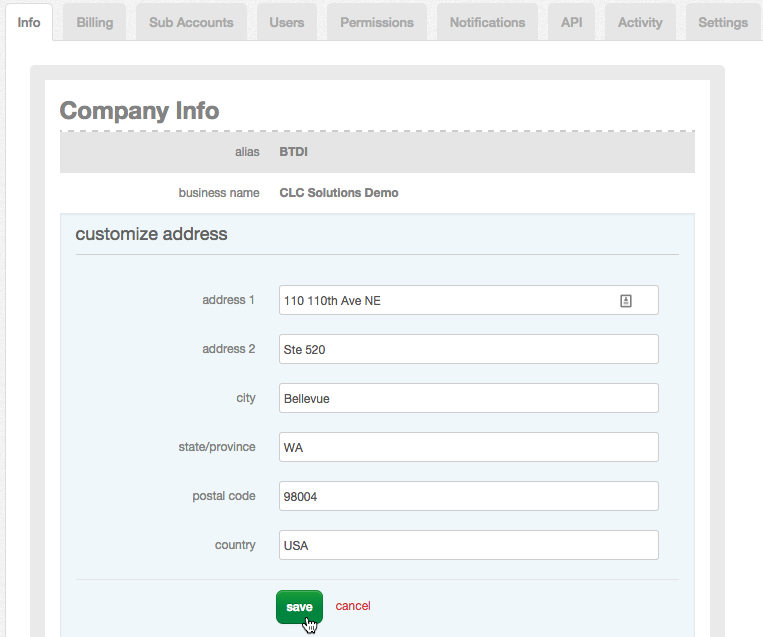
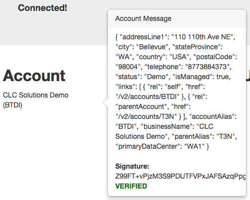
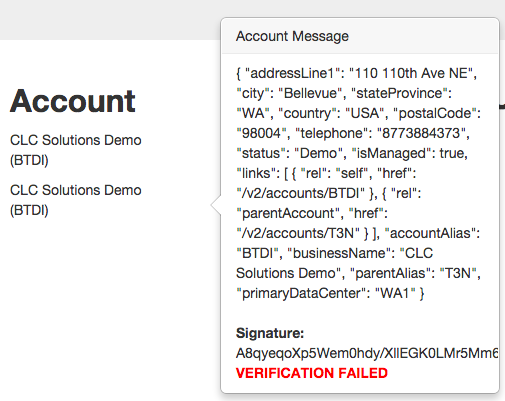

{{{
  "title": "Configuring Webhooks and Consuming Notifications",
  "date": "10-13-2014",
  "author": "Richard Seroter",
  "attachments": []
}}}

### Description

Webhooks make it possible to subscribe to key events that occur in the CenturyLink Cloud. In this article, we will walk through how to create a Webhook listener, configure a Webhook, and receive a notification. For general details on Webhooks, read the [Webhook FAQ](webhooks-faq.md).

### Prerequisites

- Must have a CenturyLink Cloud account
- Must be able to deploy applications to an internet-facing location that has legitimate SSL certificates

### Detailed Steps

#### Build the Webhook Listener

A Webhook listener is simply a web application that can receive a JSON message via `HTTP POST`. A working example application written in Node.js can be [downloaded from GitHub](https://github.com/Tier3/Examples/tree/master/CLC.WebHookListener). When designing a Webhook listener, consider the following activities:

1. Decide what events to subscribe to. Webhooks support Account, Alert, User, and Server events.
2. Process HTTP POST requests. In the example Node.js application, [this is done in the app.js file](https://github.com/Tier3/Examples/blob/master/CLC.WebHookListener/app.js).

    app.post('/webhook/account', function(req, res){

      //extract the signature header
      var signatureHeader = req.get('Tier3-RsaSha1');

      //call function to send webhook data to client browser
      BroadcastAccountWebhook(req.body, signatureHeader);

      //send OK response to CenturyLink Cloud
      res.send("ok");

    })

3. Handle the payload for each message type. In the example project, this is done in [a client-side JavaScript file](https://github.com/Tier3/Examples/blob/master/CLC.WebHookListener/public/javascripts/sockethandler.js) and the entire payload is shown to the user. A listener application that uses typed object definitions must be able to deserialize the JSON structures. Examples of each payload type can be found in the [Webhooks FAQ](webhooks-faq.md).

#### Deploy the Webhook Listener

1. Webhooks must be deployed to an internet-facing location that is reachable by the CenturyLink Cloud platform.

2. Identify a host (public cloud IaaS, public cloud PaaS, or on-premises data center) with a valid (not self-signed) SSL certificate.

3. Deploy the application and ensure that it's reachable. For this demonstration, the listener was deployed to a non-CenturyLink Cloud public Cloud Foundry environment hosted by Pivotal.

#### Configure a Webhook in the CenturyLink Cloud

1. Go to the CenturyLink Control Portal, log in, and select the **API** option from the navigation menu.

2. Switch to the **Webhooks** sub-tab and review the list of available Webhooks. You can configure unique endpoints for each individual Webhook. In the image below, notice that the **Account.Updated** Webhook was set with the URL to the listener web application. A Webhook will respond to events that occur in sub-accounts if the "include sub-accounts" checkbox is selected.

3. Click **Save** when the configuration is complete.

4. Add Webhook URLs for any other Webhooks of interest.

#### Test the Webhook

1. Trigger an event in the platform that the Webhook will respond to. View the [Webhook FAQ](webhooks-faq.md) for a list of what platform events will trigger a Webhook notification. To get the **Account.Updated** Webhook configured above to fire, change an account setting such as the mailing address.

2. Save the account change. Within seconds, the Webhook listener service should receive the notification message. In [the sample application](https://github.com/Tier3/Examples/tree/master/CLC.WebHookListener), this information is pushed to the browser. Clicking on the updated account's name reveals both the full payload and the hashed signature value.

#### Verifying the Webhook Signature

Each Webhook notification includes a signature attached in the `Tier3-RsaSha1` header. This signature is generated by creating a SHA-1 hash from the JSON payload and encrypting it with an RSA private key. It can be verified by following these steps:

- Generate a SHA-1 hash from the message body
- Decrypt the signature using CenturyLink Cloud's public key (which can be found in the [Webhook FAQ](webhooks-faq.md))
- Compare these two values and confirm they are equal. If they're not, the message did not come from CenturyLink Cloud.

Though someone trying to be malicious may change the JSON message, they will not be able to get the correct signature to match up without the use of the private key. This confirms that the message indeed came from CenturyLink Cloud and not someone spoofing or tampering with the message in-flight.

Notice in the screenshot above that under the hashed signature value, there is a **VERIFIED** message in green. This is because the example application performs this verification and outputs the results. In the code above for the account Webhook handler, we retrieve the signature from the `Tier3-RsaSha1` header. Later [in the code](https://github.com/Tier3/Examples/blob/master/CLC.WebHookListener/app.js), we verify the signature

    function VerifySignature(data, signatureHeader) {
      var publicKey = fs.readFileSync(path.resolve(__dirname, 'public.pem')).toString();
      var key = new rsa(publicKey, 'pkcs8-public-pem', {"signingScheme":"sha1"});
      return key.verify(data, signatureHeader, 'utf8', 'base64');
    }

If this verification failed because the message was tampered with or came from someone else, the following message would appear. Notice the message matches the one above, but signature does not.

